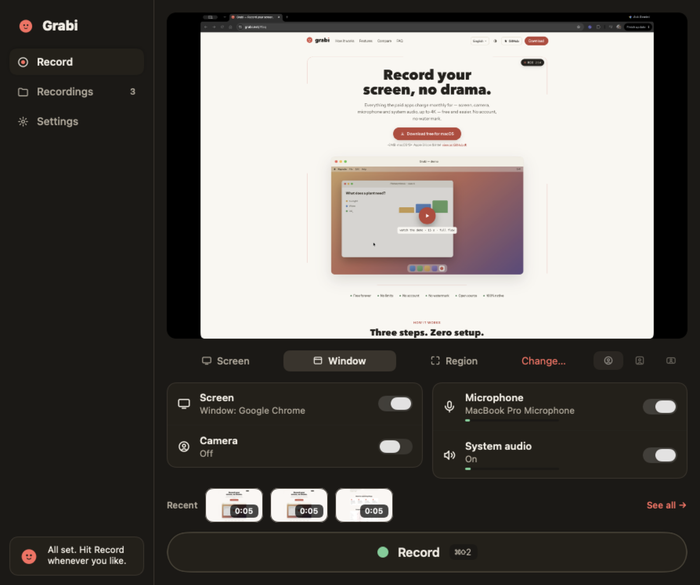
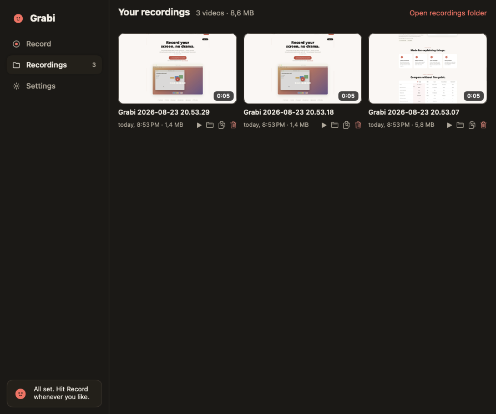
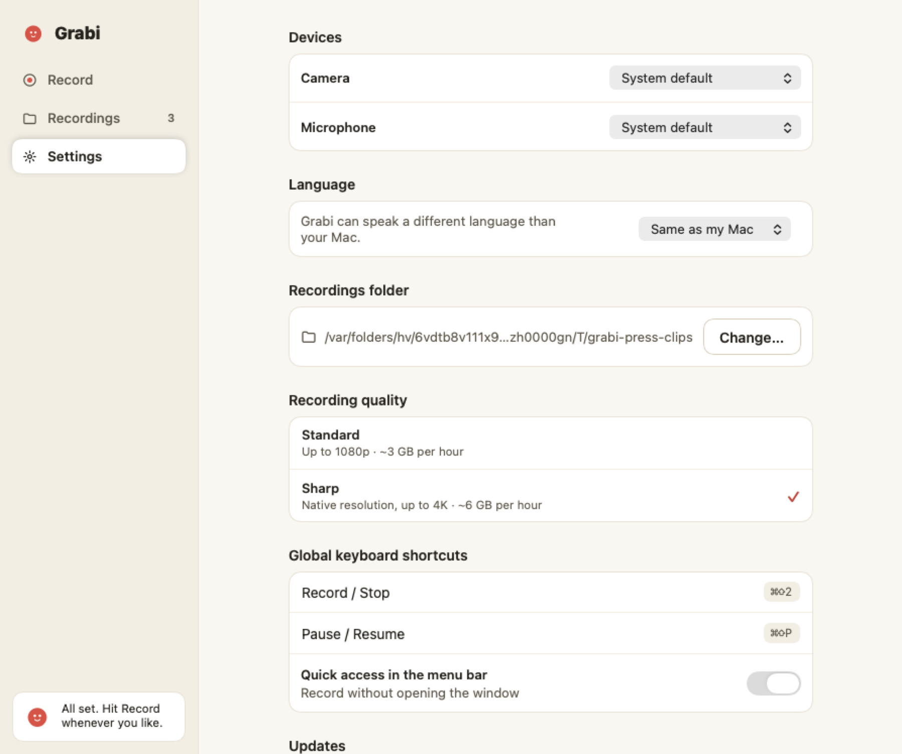

<div align="center">


# Grabi

### Record your screen, no drama.

A native macOS screen recorder that fits in one window: pick what to record,
hit the red dot, done. Free, no account, no watermark, nothing leaves your Mac.

[](https://dl.grabi.net/macos/latest/Grabi.dmg)
[](https://grabi.net)


</div>

---

## What it does

Four independent sources — **screen** (a display, a window or a region you
draw), **camera**, **microphone** and **system audio** — recorded together
into a single `.mov`: hardware HEVC video plus the microphone and the system
audio on **two separate tracks**, so you can mix them later.

|  |  |
|---|---|
| **Live preview** | What you see is exactly what gets recorded. |
| **Camera as you like it** | Circle, square or rectangle — dragged, resized and reshaped **while recording**. |
| **Pause without gaps** | N pauses, zero seams in the file. |
| **Live level meters** | Microphone and system audio, so you know they are actually there. |
| **Global shortcuts** | ⌘⇧2 record/stop · ⌘⇧P pause, from any app. |
| **Everything local** | No account, no cloud, no watermark. The ● REC badge is always visible. |

## The window

<table>
<tr>
<td width="50%"><p align="center"><b>Record</b> — sources, preview and the red dot</p></td>
<td width="50%"><p align="center"><b>Recordings</b> — play, reveal, copy or trash</p></td>
</tr>
</table>

<p align="center">
<br/>
<b>Settings</b> — devices, language, folder, quality, shortcuts and updates
</p>

While recording, the window steps aside: a floating pill (timer, pause, mute,
camera off, stop), a red border around what is being captured, and the selfie
frame you can drag live. Grabi's own windows never appear in your video.

## Download

**[Grabi for macOS 13+](https://dl.grabi.net/macos/latest/Grabi.dmg)** ·
[all versions](https://github.com/freeloz/grabi-macos/releases) ·
[checksums](https://dl.grabi.net/macos/latest.json)

Every DMG publishes its SHA-256 next to the file:

```bash
shasum -a 256 Grabi-*.dmg   # must match the published .sha256
```

> **Beta signing.** Builds are signed with a stable local certificate and a
> hardened runtime, but Apple notarization is still pending. On first launch:
> System Settings → Privacy & Security → *Open Anyway*. If macOS claims the
> app "is damaged", run `xattr -cr /Applications/Grabi.app` once — it only
> clears the download mark.

From 0.1.4 on, Grabi updates itself ([Sparkle](https://sparkle-project.org),
EdDSA-signed appcast at `dl.grabi.net/macos/appcast.xml`).

## Build it yourself

Requirements: macOS 13+, Swift 5.9+ (Command Line Tools are enough). One
external dependency — Sparkle — everything else is Apple frameworks.

```bash
./make-app.sh           # builds and packages dist/Grabi.app
swift test              # domain + use cases, in-memory fakes, ~20 ms
swift run EngineChecks  # engine integration checks, no permissions needed
```

## How it is built

Layers, with the dependencies pointing inward — the full map and how to
extend it live in **[ARCHITECTURE.md](ARCHITECTURE.md)**:

```
GrabiDomain     entities, value objects and ports · pure Swift, no frameworks
GrabiUseCases   capture lifecycle · record/stop/pause · devices · library
RecordApp       SwiftUI screens + one adapter per port + composition root
RecordEngine    ScreenCaptureKit · AVFoundation · AVAssetWriter · Metal PiP
RecordUI        the design system as SwiftUI components
```

Engine decisions worth knowing: one pipeline feeds both the preview and the
writer; every source stamps its timestamps with the host clock and pausing
subtracts the accumulated offset; frames stream straight to disk (RAM stays
flat at ~50 MB through hour-long recordings); and **nothing captures unless
someone is looking** — leaving the Record tab releases the camera, the screen
and the microphone.

`design/` holds the brand manual, the design system and the approved
prototypes: it is the UI specification, and Settings → *Design system gallery*
shows every component in all of its states.

## Languages

Grabi speaks **English, Spanish, Portuguese, French and German**, following
the system language — or whichever one you pick in Settings, applied without
relaunching. Recording file names stay neutral
(`Grabi 2026-08-23 20.53.29.mov`) so they never change with the language.

**Contributing a translation:** copy `Sources/<Target>/Resources/en.lproj` to
your language code, translate with the brand voice (warm, simple, honest —
see `design/`), keep the `%@`/`%d` placeholders, and check it with
`.build/debug/RecordApp --screenshots /tmp/i18n -AppleLanguages "(xx)"`.

## Permissions

Screen Recording (which covers system audio), Camera and Microphone — only to
record. Grabi tells you what is missing **before** you start, takes you to the
exact System Settings pane, and offers to record without whatever is blocked.

## Reporting problems

Settings → **Report a problem…** opens a pre-filled issue with your app
version, macOS version, chip and language. Updater events are logged to
`~/Library/Logs/Grabi/updater.log` (short lines, no personal data). Or open an
[issue](https://github.com/freeloz/grabi-macos/issues/new/choose) — any
language is welcome.

## Honest limits today

No Apple notarization yet (see above). Window capture follows the window, but
the indicator border uses the position it had when recording started. And
Grabi records — it does not edit.

## Grabi Cloud, and how this stays free

The app is and will remain **open source (MIT) and 100% functional without an
account** — recording is local, forever, no strings. **Grabi Cloud** is our
optional hosted service (share a recording as a link, coming soon): videos
only leave your Mac when *you* tap "Share to Grabi Cloud", and its paid plan
is how we fund the free app. The cloud backend is a separate private service;
nothing in this repo depends on it.

---

<div align="center">

**[grabi.net](https://grabi.net)** · MIT · made with calm by
[Freeloz](https://github.com/freeloz)

</div>
